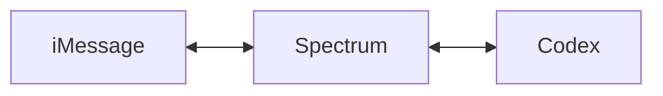

# Codex on iMessage

Text Codex on iMessage.

## How it works

1. Sign in to ChatGPT (the same account that has Codex)
2. Connect Spectrum and claim a phone number
3. Open iMessage with that number — Codex replies inline

## Commands

| Message                | What it does                                              |
| ---------------------- | --------------------------------------------------------- |
| _anything_             | Asks Codex. Threads are stateful — follow-ups remember.   |
| `/help`                | Lists every command.                                      |
| `/new`                 | Starts a fresh Codex thread. 👍 tapback to confirm.       |
| `/branch`              | Shows the branch Codex runs against.                      |
| `/branch <name>`       | Switches branch and starts a fresh thread.                |
| `/switch`              | Lists your environments (numbered).                       |
| `/switch <number>`     | Picks an environment and starts a fresh thread.           |

Every message you send gets a 👍 tapback when Codex picks it up, and the
tapback flips to ❤️ when the task is finished.

## Privacy

- ChatGPT OAuth tokens are AES-256-GCM encrypted at rest.
- Disconnect any time from the dashboard. Codex stops replying immediately
  and the encrypted tokens are wiped.
- Full notice: [PRIVACY.md](./docs/PRIVACY.md).

## Legal & trademarks

Codex on iMessage is an **independent, unofficial bridge** built by
[Photon](https://photon.codes). It is **not affiliated with, endorsed by,
or sponsored by** OpenAI or Apple.

- **ChatGPT®**, **Codex**, and their logos are trademarks of OpenAI OpCo, LLC.
- **iMessage®**, **Messages**, **iPhone**, **macOS**, **Apple** are
  trademarks of Apple Inc.

Use of these names here is purely descriptive — to identify the upstream
services this bridge talks to. We do not redistribute or rehost OpenAI
or Apple artwork. See [NOTICE.md](./docs/NOTICE.md) for the full statement.

Terms of use: [TERMS.md](./docs/TERMS.md).

Rights holders: open an issue or email **daniel@photon.codes** and we will
respond promptly.

## License

[MIT](./LICENSE). You also accept the project's
[Notice](./docs/NOTICE.md), [Terms](./docs/TERMS.md), and [Privacy](./docs/PRIVACY.md)
when using the hosted Service.
